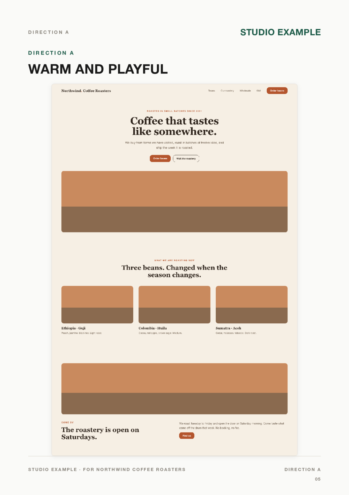

# design-proposal-kit

Turn a client brief into the design proposal PDF you actually send: a few pages
explaining the page structure, then one full-page mockup per design direction.

The mockups come from an image chat, made by you, by hand. This kit owns
everything around that: the prompt bundles that go in, the stacking that turns
loose section images into one continuous page, and the A4 render that comes out.



## Two phases, and a stop in between

```
PHASE 1                          YOU                       PHASE 2
brief -> prompt bundles   ->   paste into chat,      ->    stack -> A4 PDF
                               drop images in inbox
         [ hand over, stop ]                               [ resume here ]
```

The handoff is a fixed folder per direction, `bundles/<slug>/images/`. Phase 1
creates it empty. You fill it. Phase 2 reads it. Nothing guesses.

## Why it exists

Design proposals are mostly the same document every time: cover, structure, three
directions, next steps. What varies is the client and the pictures. The parts
that stay the same are also the slow parts, namely writing the same prompt
scaffolding, cropping repeated navigation bars off screenshots, and rebuilding
the same page skeleton.

## What it does not do

- It does not call an image API and does not want a key. You generate the images
  in whatever chat you already pay for.
- It does not invent facts. If the brief does not say it, it goes on the "What we
  still need" page.

## Requirements

- **Node 18+**, for the renderer.
- **ImageMagick 7** (`magick` on your PATH), for stacking. The renderer alone
  does not need it.
- **A POSIX shell.** The stacking scripts are bash and `npm run example` uses a
  shell loop. On Windows, use WSL or Git Bash.

## Install

```bash
git clone https://github.com/rhvisuals/design-proposal-kit.git
cd design-proposal-kit
npm install
npx playwright install chromium
```

## See it work

```bash
npm run example
```

That fills three bundle inboxes with synthetic section mockups for a fictional
roastery, crops the repeated navigation off, stacks each direction into one
continuous homepage, and renders `example/proposal.pdf`. Nothing in the example
is real and no image model is involved. See [`example/README.md`](example/README.md).

Note: this rewrites the committed `example/proposal.pdf`. `git checkout
example/proposal.pdf` puts it back.

## Use it for real

**Phase 1.** Write one bundle per direction, each with an empty `images/` inbox.
Format: [`reference/bundle-format.md`](reference/bundle-format.md). Then stop and
go to the chat.

**The chat.** One fresh chat per direction. Two pastes, in this order:
`01-SYSTEM-PROMPT.md` (the whole file), then `00-PASTE-ME.txt`. One image per
section. Drop what comes back into that bundle's `images/`, named `1-hero.png`,
`2-...`, `3-...`. The leading number is the stacking order.

**Phase 2.** Measure the repeated navigation once, then stack each direction:

```bash
# read the nav height off a ruler overlay
./scripts/stack-sections.sh -m bundles/warm-and-playful/images/2-beans.png

# stack the whole direction from its inbox, cropping that many pixels
./scripts/stack-direction.sh -c 72 bundles/warm-and-playful
```

Then build the PDF. **One folder per proposal, at the repo root**, the same shape
as `example/`:

```bash
mkdir acme
cp templates/proposal-starter.html acme/proposal.html
# fill it in, then:
node scripts/render-pdf.cjs acme/proposal.html
```

That depth matters: the starter's stylesheet link is `../templates/…`, so it
resolves from one folder down and nowhere else. Get it wrong and the PDF renders
unstyled with no error.

Last step, every time: **look at every page of the PDF.** Not the HTML.

## Branding it

Everything brand-specific is a CSS variable at the top of
`templates/proposal-base.css`. Change `--accent` first, then the fonts. The
default is deliberately plain so it does not look like someone else's deck.

```css
:root{
  --accent:#1F5C4A;
  --font-head:"Your Display Font", Helvetica, sans-serif;
  --font-body:"Your Text Font", Helvetica, sans-serif;
}
```

## Layout

```
SKILL.md                                  the workflow, as an agent skill
prompts/section-mockup-system-prompt.md   paste 1 in every image chat
reference/bundle-format.md                what a bundle contains, and the inbox
reference/style-references.md             the eight styles and where to find them
reference/pdf-structure.md                page order and CSS classes
templates/proposal-base.css               tokens and components
templates/proposal-starter.html           skeleton to copy
scripts/stack-direction.sh                phase 2: one inbox -> one page
scripts/stack-sections.sh                 the low-level stacker and nav measurer
scripts/render-pdf.cjs                    HTML -> A4 PDF
example/                                  a complete worked example
```

## Using it as an agent skill

`SKILL.md` is written for coding agents that read skill files (Claude Code and
similar). Point your agent at this folder and the workflow, limits and checks
come with it. It works fine as plain documentation too.

## Licence

MIT. See [LICENSE](LICENSE).
